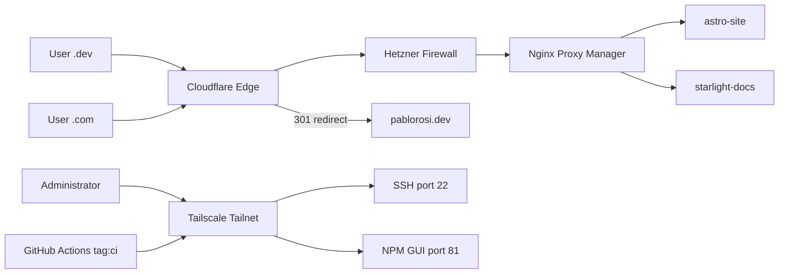

## Executive Summary

The **Secure Cloud Routing** project is a modern, containerized infrastructure designed to host and route web traffic securely with a Zero Trust approach for administrative access.

Hosted on a Hetzner Virtual Private Server (VPS) in **Nuremberg, Germany**, the environment utilizes Docker to containerize all services, ensuring reliable and reproducible deployments. Traffic is routed globally through Cloudflare's edge network, managed locally via Nginx Proxy Manager, and secured with Let's Encrypt SSL certificates. Administrative endpoints are strictly isolated from the public internet using a Tailscale overlay network.

:::note[EU Data Residency]
Hetzner Cloud operates within the EU. Hosting in Germany keeps user-facing infrastructure under EU jurisdiction, which aligns with GDPR-conscious deployment practices common in German enterprises.
:::

---

## Key Capabilities

* **Public Web Hosting:** Securely serves `pablorosi.dev` and `docs.pablorosi.dev`.
* **Legacy Redirection:** Intercepts and redirects traffic from `.com` domains to the `.dev` equivalent at the Cloudflare edge.
* **Zero Trust Administration:** Restricts SSH and the Nginx control panel to authenticated devices on the private Tailnet.
* **Automated Deployments:** Uses GitHub Actions CI/CD pipelines for continuous updates over the Tailscale network.

---

## Architecture Diagram

---

## Stack and Responsibilities

| Component | Role |
| :--- | :--- |
| **Hetzner VPS** | Compute host running Ubuntu and Docker |
| **Cloudflare** | DNS, CDN, DDoS protection, and legacy redirects |
| **Hetzner Cloud Firewall** | Layer 4 ingress filter on the public interface |
| **Nginx Proxy Manager** | Reverse proxy, virtual hosts, and origin TLS |
| **Tailscale** | Encrypted overlay for SSH, admin UI, and CI/CD |
| **GitHub Actions** | Build static sites and deploy over Tailscale |
| **Docker Compose** | IaC for container lifecycle and networking |

---

## Documentation Directory

This section is divided into six sequential phases, mapping the flow of traffic from the public edge down to the private server:

* **[1. Hetzner VPS & Docker Foundation](./1-hetzner-docker-foundation)**
    Server provisioning, resource allocation, and Docker Compose as Infrastructure as Code (IaC).
* **[2. Cloudflare DNS & Edge Routing](./2-cloudflare-dns-routing)**
    DNS configuration, proxy settings, and Redirect Rules for legacy domains.
* **[3. Cloud Firewall](./3-firewall)**
    Hetzner Cloud Firewall rules that filter public ingress before traffic reaches the OS.
* **[4. Nginx Reverse Proxy & Public SSL](./4-nginx-reverse-proxy)**
    Internal traffic routing, container networking, and Let's Encrypt origin certificates.
* **[5. Tailscale Private Admin Access](./5-tailscale-admin-security)**
    Zero Trust implementation for SSH and the Nginx control panel via the Tailscale overlay.
* **[6. GitHub Actions CI/CD Pipeline](./6-github-cicd-pipelines)**
    Automated deployment workflows for the portfolio and documentation repositories.

