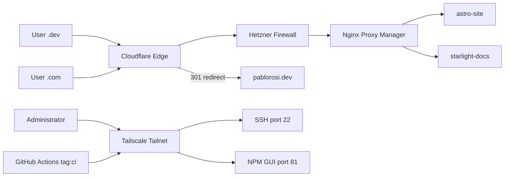

:::caution[Legacy architecture]
This section documents the **original** all-in-one cloud stack on a Hetzner VPS. Static frontends have moved to **[V2 — Cloudflare Pages Migration (Current)](/cloud-infrastructure/v2--cloudflare-pages-migration-current/)**. The Hetzner server remains for **backend and dynamic workloads** under the v2 model.
:::

## Executive Summary

**V1 — Hetzner Secure Cloud Routing** was a containerized infrastructure designed to host and route **all** web traffic — static and dynamic — from a single VPS in **Nuremberg, Germany**, with a Zero Trust approach for administrative access.

Docker containerized every service. Cloudflare handled DNS and edge proxying. Nginx Proxy Manager managed TLS and virtual hosts. Tailscale isolated SSH and admin access from the public internet.

:::note[EU Data Residency]
Hetzner Cloud operates within the EU. Hosting in Germany keeps infrastructure under EU jurisdiction, which aligns with GDPR-conscious deployment practices common in German enterprises.
:::

---

## Key Capabilities (v1)

* **Public Web Hosting:** Served `pablorosi.dev` and `docs.pablorosi.dev` from the same VPS.
* **Legacy Redirection:** Intercepted and redirected `.com` traffic to `.dev` at the Cloudflare edge.
* **Zero Trust Administration:** Restricted SSH and the Nginx control panel to authenticated devices on the Tailnet.
* **Automated Deployments:** GitHub Actions built static sites and deployed over Tailscale via SCP + SSH.

---

## Architecture Diagram (v1)

---

## Stack and Responsibilities (v1)

| Component | Role |
| :--- | :--- |
| **Hetzner VPS** | Compute host running Ubuntu and Docker |
| **Cloudflare** | DNS, CDN, DDoS protection, and legacy redirects |
| **Hetzner Cloud Firewall** | Layer 4 ingress filter on the public interface |
| **Nginx Proxy Manager** | Reverse proxy, virtual hosts, and origin TLS |
| **Tailscale** | Encrypted overlay for SSH, admin UI, and CI/CD |
| **GitHub Actions** | Build static sites and deploy over Tailscale |
| **Docker Compose** | IaC for container lifecycle and networking |

---

## Documentation Directory

* **[1. Hetzner VPS & Docker Foundation](./1-hetzner-docker-foundation)**
* **[2. Cloudflare DNS & Edge Routing](./2-cloudflare-dns-routing)**
* **[3. Cloud Firewall](./3-firewall)**
* **[4. Nginx Reverse Proxy & Public SSL](./4-nginx-reverse-proxy)**
* **[5. Tailscale Private Admin Access](./5-tailscale-admin-security)**
* **[6. GitHub Actions CI/CD Pipeline](./6-github-cicd-pipelines)** — legacy docs deploy (replaced by Cloudflare Pages in v2)

---

## Superseded by v2

Static frontends no longer use `docker-compose.yml` or the Hetzner deploy workflow. See **[V2 — Cloudflare Pages Migration (Current)](/cloud-infrastructure/v2--cloudflare-pages-migration-current/)** for the current split: Pages for static sites, Hetzner for backend.
