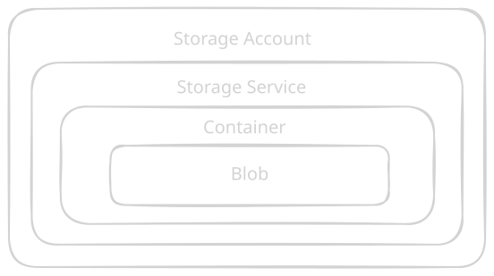
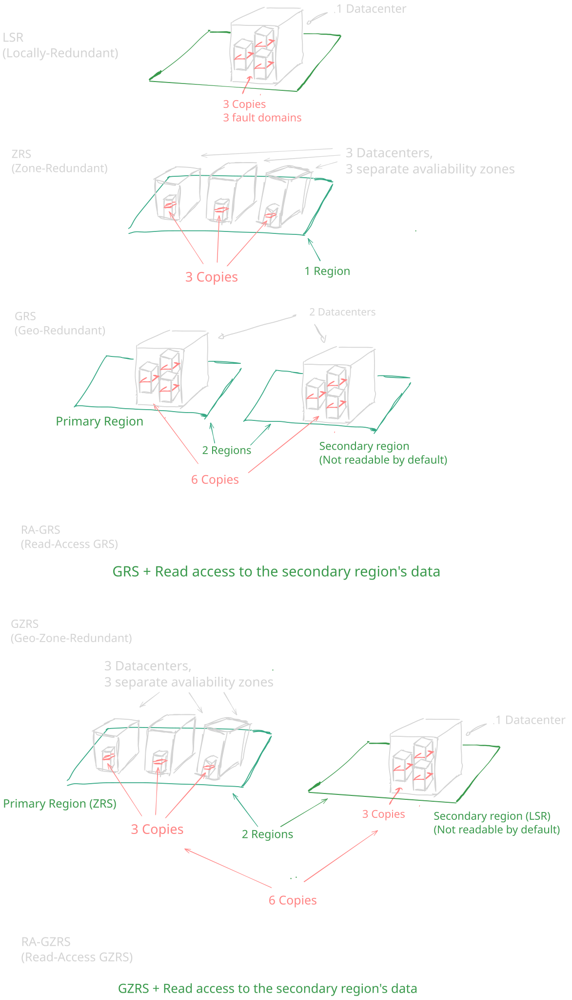

### The Storage Account:

The root container for your data. Provides the unique namespace (the URL).
Rules:
* The name must be globally unique
* Between 2 and 24 characters 
* Can only contain lowercase letters and numbers

### The Storage Service

Inside the Storage Account, Azure offers four different storage services:
* Blog storage: for Unstructured object data.
* Azure files: for traditional SMB/NFS file shares
* Queue storage: For messaging between application components.
* Table Storage: For NoSQL structured data.

### The container

A container organizes a set of blobs, similar to a directory in a file system.
Rules:
* A storage account can have an unlimited number of containers and a container can store an unlimited number of blobs
* You can't nest containers.

### The Blob

Blob stands for Binary Large Object. This is the actual file
There are 3 distinct types of blobs:
* Block Blobs
* Append Blobs
* Page Blobs

If you want a real, structural file system instead of a flat namespace, you upgrade your standard Blob Storage to Azure Data Lake Storage Gen2 (ADLS Gen2).

Under the Advanced Tab when creating the Storage Account -> Enable hierarchical namespace (HNS)

Enabling HNS unlocks POSIX Access Control Lists.

### POSIX (Portable Operating System Interface)

Family of standards created to maintain compatibility across operating systems (primarly Unix and Linux)
In linux. It it the standard that defines the classic file permission system; Read (r), Write (w), Execute (x)

### Access Tiers

#### 1. Hot tier

For data that is accessed or modified frequently. Has the highest storage cost but the lowest cost for reading and writing data 

#### 2. Cool Tier

For data you plan to store for at least **30 days** and don't access often. Cheaper to store than the hot tier, but more expensive if you need to store data.

#### 3. Cold Tier

For data you plan to store for at least 90 days. Even cheaper than the cool tier, but higher read costs.

#### 4. Archive Tier 

For data you plan to store for at least 180 days and hope to never actually need. The absolute cheapest storage cost, but it is imposible to read. To access the data you have to change to Hot o Cool. This process is know as Rehydration.

* Standard priority: Takes 15 hours to complete.
* High Priority: Takes 1 hour to complete, but the cost is significantly higher 

You are must respect the minimum days (30,90,180). 
For example if you upload a file to the Archive tier, and you delete it the next day.
At the end of the month you will get a Early Deletion Fee in your invoice.

Account Level vs Blob Level

* Account Level: When creating the Storage Account you must choose a default acess tier for the entire account. An the account level you can only choose Hot or Cool.

* Blob Level: You can override the account setting on a file-by-file basis. You can select a specific old PDF and change only that single file to Archive

Depending of the region the storage has different prices.

### Redundancy

#### Primary Region Redundacy (Single Region)

**Locally-redundant storage (LRS)**

Stores 3 copies of your data on a single physical storage cluster within one datacenter.
Protects against hardware failures. If the datacenter floods or catches fire, your data is gone.

**Zone-redundant storage (ZRS)**

Stores 3 copies of your data synchronously spread across 3 different Availability zones (Separate physical datacenters with independent power and cooling) within the same region. Protects against an entire datacenter failing 

#### Secondary Region Redundacy (Cross-Region)

Geo-redundant storage (GRS)
Stores 6 copies total. Performs LRS in your primary region, and then asynchrously replicates the data to the secondary paired region, where it is also stored using LRS.

Geo-zone-redundant storage (GZRS)
Stores 6 copies total. It performs ZRS (3 copies across 3 zones) in your primary region, and asynchronously replicates to the secondary paired region using LRS.

With standard GRS o GZRS the data in your secondary region is invisible and inaccessible. You cannot read it or write to it. It just sits there silently as a backup.

RA-GRS and RA-GZRS -> Adding "Read-Access" gives you a secondary endpoint URL. This means your application can actively read from the secondary region at any time. This is incredibly useful for load-balancing read-heavy applications.

The Asynchronous Trap: Replication to a secondary region happens asynchronously. This means there is a slight delay. If a disaster destroys your primary region right after a user uploads a file, and you trigger a failover, that file might not have replicated yet

When you initiate a failover, the secondary region your primary region. Azure automatically updates the DNS records, but during this process, your storage account will briefly be unavailable.

**ZRS is NOT everywhere:** Not all Azure regions have Availability Zones. If an exam question places you in a smaller region that lacks zones, you cannot select ZRS or GZRS as an answer.

**Lifecycle Management Rule**

Under the hood, these rules are just JSON code. Every rule is built using three specific parts:

1. **The Filter:** This tells Azure _which_ data the rule applies to. You can apply a rule to the entire storage account, or filter it down to a specific container (e.g., only files inside the `logs/` container) or specific file types (e.g., only `.mp4`files).
    
2. **The Condition:** This is the trigger. It is usually based on time. For example, `daysAfterModificationGreaterThan` (the file hasn't been modified in X days) or `daysAfterCreationGreaterThan`.
    
3. **The Action:** This is what Azure actually does to the file when the condition is met. The actions are usually:
    
    - `tierToCool` (Move to the Cool tier)
        
    - `tierToArchive` (Move to the Archive tier)
        
    - `delete` (Permanently delete the blob)

