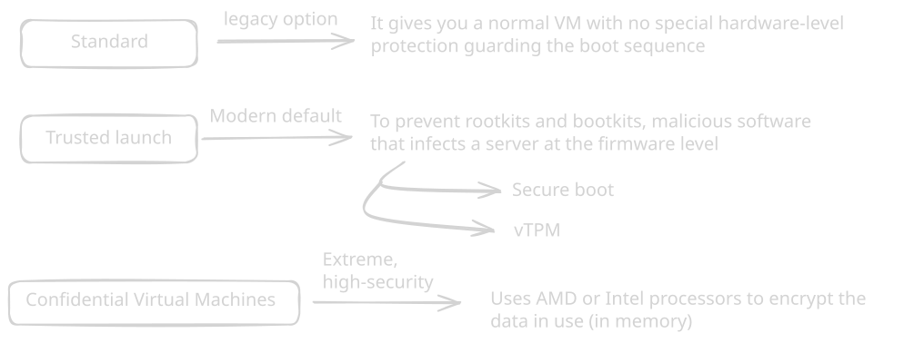
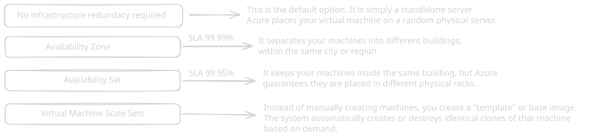

## Security

## Avaliability

## Sizes

### General Purpose 
* D-Series ("Default") -> Balanced CPU-to-memory ratio
* B-Series ("Burstable") -> Budget-friedly VMs. They run at low baseline CPU performance but accumulate "credits" when idle. If traffic spikes, they consume those credits to burst to 100% CPU
### Compute Optimized
* F-Series ("Fast CPU") -> High CPU-to-memory ratio.
### Memory Optimized 
* E-Series ("Extra RAM") -> These offer massive amount of RAM compared to the CPU.
* M_Series ("Massive") -> These VMs offer the largest memory configurations in Azure (up to several terabytes of RAM).
### Specialized Workloads 
* L-Series ("Large Storage") -> Storage-optimized VMs, They have high disk throughput and massive, fast local NVMe storage for NoSQL or big data 
* N-Series ("Nvidia") -> Equiped with physical GPUs.
* H-Series ("High-Performance Computing - HPC") -> Designed to talk to each other over incredibly fast networks.
