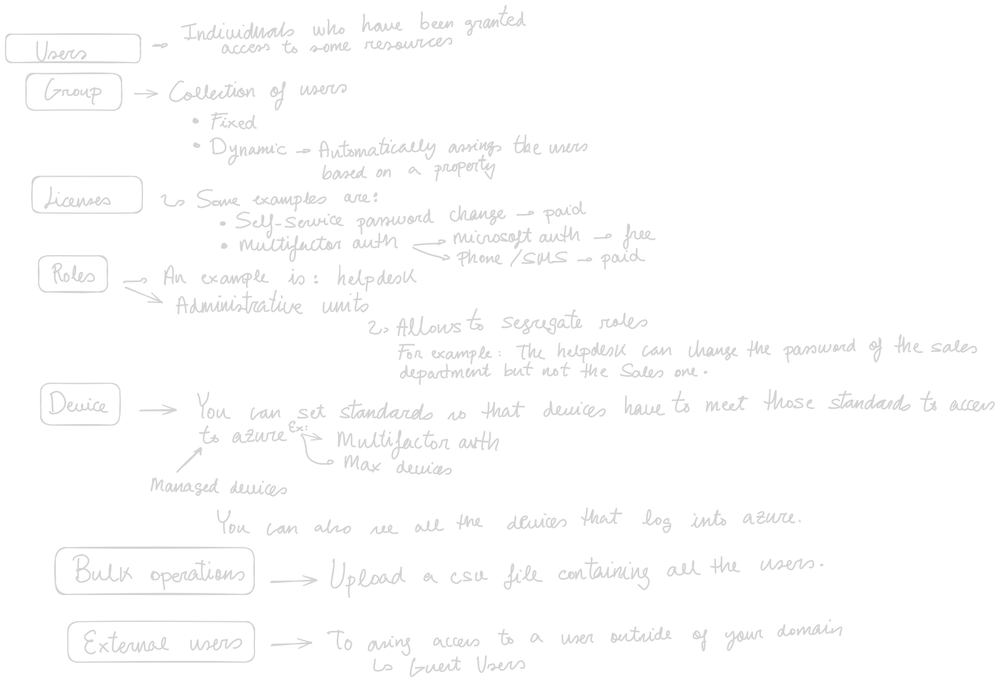

### Basic Concepts

**Account / User**-> A person or a program 
* Person: (User name, password, multi-factor auth)
* App - Managed Service ( A Principal Service managed by Azure to authenticate resources). Represents a program or service 

**Tenant** -> A representation of an organization, usually represented by a public domain name. Every azure account is a part of at least 1 tenant.

**Subscription** -> 
* Free subscription 
* Pay as you go
* Enterprise agreements
Subscriptions are assigned to tenants a tenant can have 0 or + subscriptions. But a single subscription can only trust one Tenant at a time.

**Resource Group** -> 

