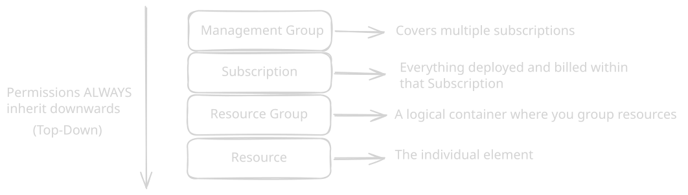

Allows to assign permissions based on the rol.

You want the users to have the fewer permissions they can have. Principle of Least Privilege.

When creating a role you are defining a job that someone can potentially need to do.

Examples:
* Developer 
* Developer manager
* IT Operations

You only assign permissions to a role and the assign the role to a user. If a user needs a permission outside of the role you either create a new role o assign the user to another exiting role.

### IAM vs RBAC 

**IAM:** Industry Concept, what Microsoft named the menu / blade you click on the portal.

**RBAC:** The actual authorization framework running under the hood.

### Difference between Microsoft Entra ID Roles and Azure RBAC Roles

**Entra ID Roles** (administrative roles) control People, licenses and tenant configurations.

These roles manage Microsoft Entra ID itself (Users, Groups, Passwords, Enterprise, Applications, billing, and Microsoft 365 services). 

By default having an Entra ID role does not give you permission to touch any virtual machines, storage accounts, or networks.

**RBAC Roles** control Infrastructure and Cloud Resources.

These roles manage Azure Resource Manager deployments. By default having an Azure RBAC role like "owner" over a Virtual Machine does not give you permission to create new users.

When you first create a tenant to be able to assign RBAC roles:

Entra ID -> Properties -> Access Management for Azure resources 

## IAM roles
### The core four:

**Owner:** Has full access to manage a ll resources and can manage IAM (assing roles to other people)

**Contributor:** Has full access to manage al resources, but cannot manage IAM.

**Reader:** Can view resources, but cannot make any changes or view secrets.

**User Access Administrator:** The esact opposite of a Contributor. This role CAN manage IAM , but cannot manage or modify the resources themselves.

### Virtual Machine Roles

**Virtual Machine Contributor:** Can create, update, and delete Virtual Machines. But cannot connect to the VNet, manage the storage account the OS disk sits on, or give other users access to the VM.

**Virtual Machine Administrator Login / User Login:**  Being a VM contributor does not give you permission to log into the OS of the VM using Microsoft Entra credentials. You need one of these specific login roles to actually RDP or SSH into the machine.

### Storage Roles 

**Storage Account Contributor:** Can manage the storage account itself (change firewall rules, create new containers). But they cannot access the actual data.

**Storage Blob data Contributor:** Read, list, create, edit and delete containers and blobs
**Storage Blob data Owner:**  Everything in contributor + POSIX / ACLs 
**Storage Blob data Reader:** Only read and list containers and blobs

### Network Roles 

**Network Contributor:** Can create and manage Virtual Networks, Network Security Groups (NSGs), and Public IP addresses

### Custom Roles (Only for Azure P1 and P2)

To create a custom role you can either Start from scratch o edit an existing role
You can only create 5000 custom roles.

You can also view manage the roles of a user in the user menu:

**Assigned roles** -> Microsoft Entra ID Roles 
**Azure role assignements** -> Azure RBAC (IAM) Roles.