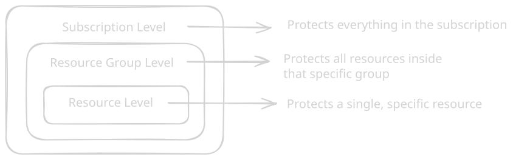
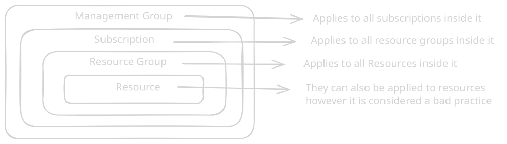

Subscription:
An agreement with Microsoft to use Azure services, and how you're going to pay for that 

* Free subscriptions 
* Pay as you go 
* Enterprise agreements

Not every account has a subscription, by default a new tenant has no subscription
It is also possible to have more than one subscription and more than one owner.

### Azure subscription 

You can set an anomaly, so that it send a email when there is a anomaly in your account: new charges, charges that were there but no there aren't 

### Resource locks
You can create a lock to prevent a resource to be deleted 

You can create them in a resource group or in the subscription or even in the individual resource.

There are 2 types of locks

* **CanNotDelete (Delete Lock):** Authorized users can still read and modify the resource, but nobody can delete it.

* **ReadOnly (Read-only Lock):** Authorized users can read the resource, but nobody can delete or update it.

### Policies

Azure Policy controls what can be created and how it must be configured. Azure Policy overrides RBAC. Even if you are the Owner of the entire subscription, if an Azure Policy explicitly denies the creation of resources with a specific tag, you will get an error when trying to deploy a resource without that tag.

**Policy Effects**: 
* Deny: Blocks the creation or update of a resource if it doesn't match the rule.
* Audit: Allows the resource to be created, but creates a warning log in the Azure Security Center showing it is "non-compliant"
* Append: Automatically adds missing fields to a resource during creation.
* DeployIfNotExists (DINE): If a resource is created but missing an associated component the policy deploys it automatically.

Must-know policies:
* Allowed Locations 
* Allowed Virtual Machine SKUs
* Require a Tag on Resources 
* Inherit a Tag from the Resource Group

### Tags

name-value or key-value pairs you apply to Azure resources.
Example: Name: `Enviroment`, Value: `Production`. 
Can be applied to Subscriptions, Resource Groups and indidual resources.

Tags applied to a Resource Group are not automatically inherited by the resources in that group.
**Maximum tags:** You can apply a max of 50 tags directly to a resource or resource group.
**Character Limits:** Tag names are limited to 512 characters, and tag values are limited to 256 characters. (Storage accounts have stricter limits: 128 for names, 256 for values).
**Case Sensitivity:** Tag names are case-insensitive, but tag values are case-sensitive.

Some resources can be moved between regions but some aren't. Microsoft has documentation about that.

