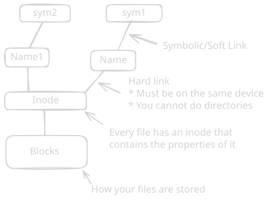

`ls` -> List files `ls l` `ls -a` `ls -lrt` `ls -d` `ls -R` 


```bash
ls --color=no
ls --color=yes
ls --color=auto
``` 


By default ls sorts the files alphabetically 
`atime` - The last time when the file was accessed 
`mtime` - Last modification time
`ctime` - Last metadata modification time (Permissions change, location of the file, etc)

-t  -> Order by mtime
-tc -> Order based in mtime
-tu -> Order based in atime
Always from new to old 

-s -> Displays the actual allocated disk space next to each directory 
-S -> Order from largest to smaller 
ls -m -> Prints the files separated by commas
ls -Q -> Prints the filenames in Quotes 
ls -l --time-style=local/iso/full-iso -> Changes the way how the date is formated in long format 


ls -A -> No muestra `..` `.` 
`mkdir` -> Create directory 
`cp` -> Copy files
`mv` -> Move files


To find files:
`which` -> looks for binaries in $PATH (Executable files)
`locate` -> uses a database, built by updatedb
`find` -> The best tool 

```bash
sudo find / -name "hosts"
sudo find / -name "*hosts"
sudo find / -type f -size +100M

sudo sh -c "find /etc/ -name '*' -type f | xargs grep 127.0.0.1"
```

-type f -> For files 
-type d -> For directories 

```bash
mkdir -p find/contents
``` 

```bash
sudo find /etc -exec grep -l student {} \; -exec cp {} find/contents/ \ 2>/dev/null
```

`-exec` tells `find`: _"For every file you find, execute this specific command on it."_

The -l flag tells grep not to print the matching lines, but instead to return a success code only if it finds the word.

In find, multiple -exec parameters act at as a logical `AND`. The second -exec will only run if the first `-exec` was successful.


