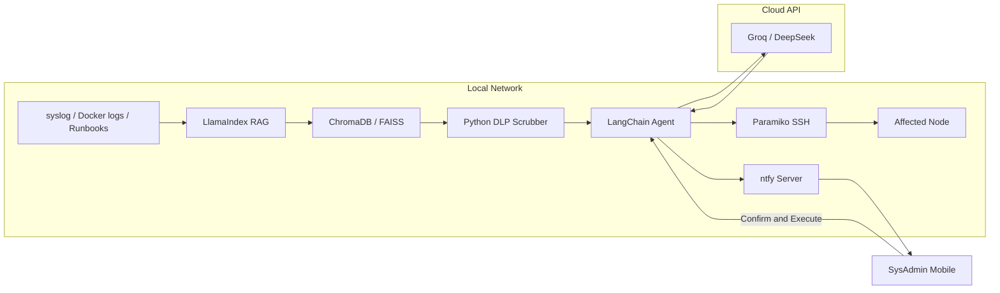

import { Aside, CardGrid, LinkCard } from '@astrojs/starlight/components';

<Aside type="note" title="Planned / Roadmap">
Architecture blueprint — implementation has not started. Development begins after CCNA and an observability baseline (Prometheus/Grafana) is in place.
</Aside>

## Project Objective

Build a **highly secure, semi-autonomous Site Reliability Engineering (SRE) assistant** that monitors local infrastructure, analyzes crash logs, and executes remediation commands via SSH.

Local hardware cannot run large language models efficiently. To bypass that limitation while maintaining a **Zero Trust** posture, the architecture uses a **cloud-based LLM** (Groq / DeepSeek) protected by a custom **local Data Loss Prevention (DLP) middleware**. Sensitive data never leaves the network in cleartext.

The agent runs on top of the [Enterprise Homelab](/enterprise-homelab/) — Prometheus, Docker logs, syslog, and internal runbooks — and shares the same security mindset as [Cloud Infrastructure](/cloud-infrastructure/) (controlled access, human-in-the-loop execution).

---

## Why Hybrid (Homelab + Cloud API)

| Constraint | Approach |
| :--- | :--- |
| Limited local GPU/CPU | Offload reasoning to Groq / DeepSeek API |
| Sensitive infra data (IPs, credentials, MACs) | Local DLP scrubber masks data **before** any cloud call |
| Untrusted autonomous execution | Human confirms via ntfy before Paramiko runs SSH remediation |
| Real SRE workflows | RAG over local logs and runbooks, not generic cloud prompts |

---

## Architecture Overview

---

## Roadmap

| Phase | Focus | Status |
| :--- | :--- | :--- |
| **0** | CCNA + homelab networking docs | **In progress** |
| **1** | [IPAM](/enterprise-homelab/ipam/) — IP/VLAN tracking app | Planned (post-CCNA) |
| **2** | Prometheus + Grafana on Proxmox | Planned |
| **3** | SRE Agent — component by component | Planned |

**Implementation order** (when phase 3 starts):

1. Python DLP scrubber
2. LlamaIndex + ChromaDB (local RAG)
3. LangChain + Groq/DeepSeek API
4. ntfy push alerts
5. Paramiko SSH remediation (human-in-the-loop)

---

## Documentation Directory

<CardGrid>
  <LinkCard title="Core Components" description="LlamaIndex, DLP scrubber, LangChain, cloud LLM, and ntfy/Paramiko." href="/local-sre-platform/components/" />
  <LinkCard title="Execution Workflow" description="Seven-step flow from crash trigger to confirmed SSH remediation." href="/local-sre-platform/workflow/" />
  <LinkCard title="Tech Stack" description="Python, LangChain, LlamaIndex, vector DB, and deployment target." href="/local-sre-platform/tech-stack/" />
</CardGrid>

---

## Related Infrastructure

* **[Enterprise Homelab](/enterprise-homelab/)** — physical and virtual infrastructure the agent monitors
* **[Observability](/enterprise-homelab/6-observability/prometheus/)** — Prometheus scrape targets and Grafana dashboards
* **[Compute / Docker](/enterprise-homelab/5-compute/docker-engine/)** — container runtime on Proxmox
