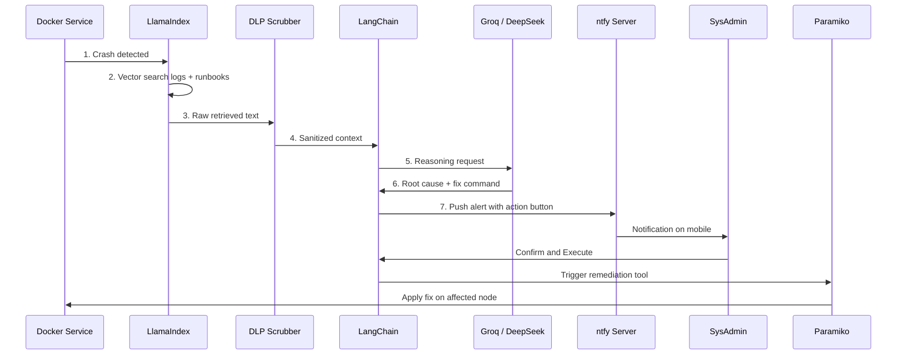

## End-to-End Flow

---

## Step-by-Step

### 1. Trigger

A critical service crashes on the main Proxmox node — for example, a Docker container exits unexpectedly or a health check fails.

### 2. Retrieval

LlamaIndex queries the local vector database to pull the exact stack trace and cross-references it with local runbooks (restart procedures, known failure modes).

### 3. Sanitization

Raw text passes through the **Python DLP Scrubber**. All MAC addresses, internal IPs, hostnames, and tokens are replaced with `[REDACTED_*]` tags.

### 4. Reasoning

LangChain sends the sanitized logs and runbook context to the **Groq** or **DeepSeek** API.

### 5. Formulation

The cloud LLM analyzes the error and formulates a fix — for example, *"Restart the database container"* — returning a structured response to LangChain with the proposed command.

### 6. Alert

A local POST request hits the **ntfy** server. The sysadmin's phone receives the analysis summary and a **Confirm & Execute** action button.

### 7. Remediation

The admin taps **Confirm & Execute**. The webhook triggers LangChain to call the `Paramiko_SSH` tool. Paramiko logs into the failing node over SSH and applies the fix.

---

## Design Principles

* **Human in the loop** — analysis can be automated; execution requires explicit approval.
* **Sanitize first, reason second** — no cloud API call receives unsanitized infrastructure data.
* **Local retrieval, cloud reasoning** — RAG stays on-prem; only masked context leaves the network.

See **[Core Components](/local-sre-platform/components/)** for per-component details.
